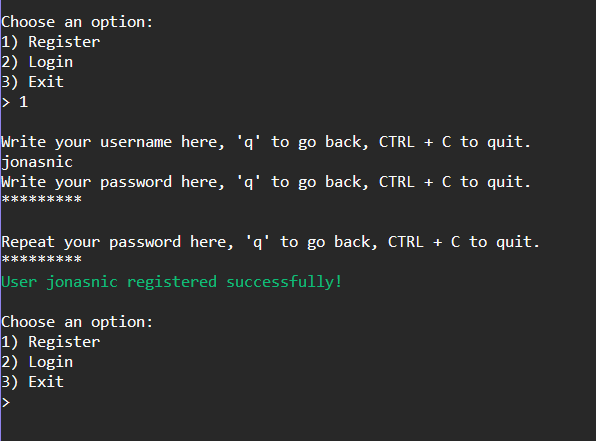
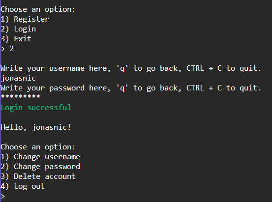
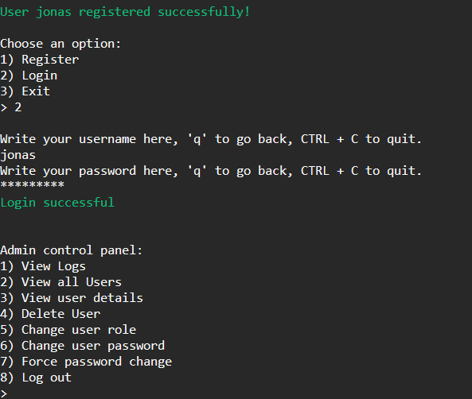
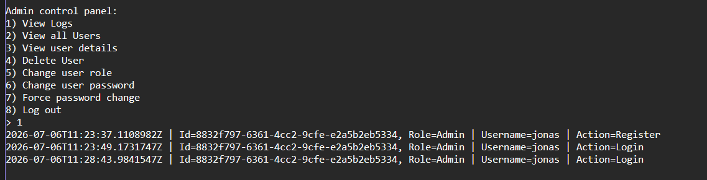

# ConsoleLoginSystem

## ConsoleLoginSystem in an easy-to-use authentication and authorization application

## Features include
- Secure password hashing
- Admin control panel
- Role-based authorization
- Register and login retry logic
- Functional decomposition

### Register and login
<p align="left">
  
  
</p>

### Admin control panel
The first user created will automatically become an admin
<p align="left">
  
</p>

The admin can perform neccessary admin operations such as viewing the logs
<p align="left">
  
</p>


## Running with Docker

Build the image and start the application:

```bash
docker compose run --build --rm consoleapp
```

On subsequent runs, if no source code has changed, you don't need `--build`:

```bash
docker compose run --rm consoleapp
```
```

Open your browser and navigate to http://localhost:5000
